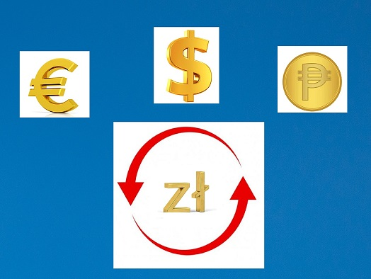

# Current-converter

 

## Demo

https://kamil-g-84.github.io/Current-converter/

## Description

I present my currency converter, where you can convert Polish zloty to currencies such as: US dollar, Euro and Colombian pesos

## Technologies used:
- HTML
- JavaScript
- CSS
- BEM convention
- Normalize
- GIT

### Folders:
The files include folders such as : css, js and index.html

## CSS:
This folder is divided into 6 files : body.css, container.css, form.css, legend.css paragraph.css and result.css. Each of them steels individual elements on the page.

## JavaScript:
In this folder there is a script.js file in which an algorithm is written that converts the Polish currency (PLN) into other currencies ountries such as the USA, Colombia and the euro, which is the official currency in 20 EU countries.

## How it works?
1. Insert an Amount in PLN (*required field).
2. Choose Currency you would like to convert to.
3. Click "Calculate!"

***Exchange rates come from 26/04/2023 from the Money.pl website***

## README
Readme will evolve with the project. Be sure to check back here often to stay up to date.
